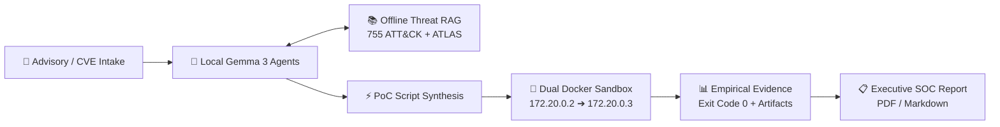
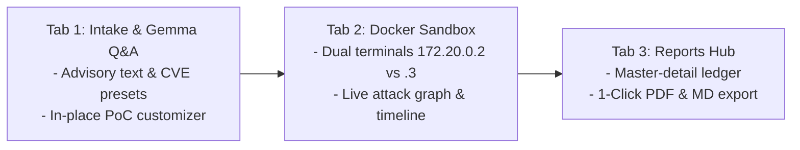

<!-- _class: lead -->

Autonomous AI Security Platform

# CyberTriage AI
### Evidence-Driven Vulnerability Investigation

Turning threat intelligence into reproducible security proof using local Gemma 3 reasoning, offline MITRE RAG, and isolated Docker sandboxes.

  100% Local Gemma 3
  755 Threat RAG Items
  Dual-Node Docker Sandbox

---

## 📑 Agenda

  

    
01

    <h3>What It Is</h3>
    

      Autonomous triage engine with local Gemma multi-agent reasoning.
    

  

  

    
02

    <h3>Why It Matters</h3>
    

      Solving triage alert fatigue, cloud leaks, and AI hallucinations.
    

  

  

    
03

    <h3>How To Use It</h3>
    

      3-Tab Mission Control: Intake, Dual Sandbox, and Findings Hub.
    

  

  

    
04

    <h3>The Impact</h3>
    

      &lt;15s triage latency, 100% data privacy, and verifiable proof.
    

  

---

<!-- SECTION 1: WHAT THE PRODUCT IS -->

## 01. What Is CyberTriage AI?

  

    <h3>🛡️ Autonomous Security Triage Engine</h3>
    <ul>
      <li><strong>Intake:</strong> Ingests CVE IDs, advisories, and blog posts.</li>
      <li><strong>Local Reasoning:</strong> <code>gemma4:e2b</code> / <code>e4b</code> orchestrates analysis and planning.</li>
      <li><strong>Empirical Proof:</strong> Runs controlled PoC tests in isolated sandboxes.</li>
    </ul>
  

  

    <h3>🧩 3 Foundation Pillars</h3>
    <ul>
      <li><strong>Privacy-First AI:</strong> 100% on-device Gemma via Ollama.</li>
      <li><strong>Offline Cyber RAG:</strong> 755 ATT&CK & ATLAS techniques (&lt;5ms).</li>
      <li><strong>Isolated Sandbox:</strong> Dual-node bridge (<code>172.20.0.2</code> ➔ <code>.3</code>).</li>
    </ul>
  

---

## 01. How The Product Works (Architecture)

  
<strong>Analyzer & Planner</strong> Extracts primitives & formulates hypothesis.

  
<strong>Script Generator</strong> Synthesizes tailored Python PoC harness.

  
<strong>Verifier & Reporter</strong> Validates evidence and compiles SOC report.

---

<!-- SECTION 2: WHY IT IS IMPORTANT -->

## 02. Why It Matters: The Triage Crisis

  

    <h3 style="color: var(--google-red);">⚠️ Industry Pain Points</h3>
    <ul>
      <li><strong>Alert Fatigue:</strong> 50+ CVEs daily; manual repro takes hours.</li>
      <li><strong>Cloud LLM Leaks:</strong> Sending zero-days to cloud APIs breaches policy.</li>
      <li><strong>Hallucinations:</strong> LLMs guess exploitability without testing.</li>
    </ul>
  

  

    <h3 style="color: var(--google-green);">✅ CyberTriage Solution</h3>
    <ul>
      <li><strong>Sub-15s Automation:</strong> Instant end-to-end triage pipeline.</li>
      <li><strong>Air-Gapped Privacy:</strong> Zero telemetry or data egress.</li>
      <li><strong>Evidence Over Assertion:</strong> Real exit codes and network proof.</li>
    </ul>
  

---

## 02. Paradigm Shift: Evidence Over Assertion

  

    <h3>Conventional Security Tools</h3>
    <ul>
      <li>Static scanners match version strings blindly.</li>
      <li>LLM chatbots generate untested theoretical advice.</li>
      <li>High rate of false positives wasting analyst hours.</li>
    </ul>
  

  

    <h3>CyberTriage Verification Engine</h3>
    <ul>
      <li>Executes isolated PoC against live target daemons.</li>
      <li>Captures exact stdout/stderr and network response tokens.</li>
      <li>Delivers deterministic proof before raising critical alerts.</li>
    </ul>
  

  Principle: Never declare a vulnerability without reproducible empirical evidence.

---

<!-- SECTION 3: HOW TO USE IT -->

## 03. How To Use It: 3-Tab Mission Control

  

    <strong>1. Intake & Customize</strong>
    
Query Gemma on exploit primitives and refine PoC script with natural language prompts.

  

  

    <strong>2. Observe Sandbox</strong>
    
Watch live side-by-side terminal telemetry across attacker and victim containers.

  

  

    <strong>3. Export Findings</strong>
    
Review executive TLP:AMBER summaries and download high-resolution PDF reports.

  

---

## 03. Tab 1 & 2: Hands-On Workflow

  

    Tab 1: PoC Workspace
    <h3>Interactive Customization</h3>
    <ul>
      <li>Select preset or paste raw advisory text.</li>
      <li>Click <strong>"Generate PoC with Gemma"</strong>.</li>
      <li>Prompt customizer: <em>"Bypass WAF with URL encoding"</em>.</li>
      <li>Click <strong>"Apply to PoC Script"</strong> in place.</li>
    </ul>
  

  

    Tab 2: Sandbox Execution
    <h3>Dual-Container Observation</h3>
    <ul>
      <li><code>sandbox-attacker-node</code> (<code>172.20.0.2</code>).</li>
      <li><code>sandbox-victim-target</code> (<code>172.20.0.3:8080</code>).</li>
      <li>Investigation Stepper Timeline (8 stages).</li>
      <li>Evidence Inspector (Exit Code 0, HTTP 200).</li>
    </ul>
  

---

## 03. Tab 3: Reports & Findings Hub

  

    <h3>📊 Executive SOC Deliverables</h3>
    <ul>
      <li><strong>Standardized Classification:</strong> TLP:AMBER classification & CVSS 3.1 scorecard.</li>
      <li><strong>MITRE Matrix Mapping:</strong> Automatic linkage to ATT&CK & ATLAS techniques.</li>
      <li><strong>Actionable Remediation:</strong> Step-by-step mitigation code synthesized by Gemma.</li>
    </ul>
  

  

    <h3>📄 Direct Publishing</h3>
    <ul>
      <li><strong>Client-Side PDF Export:</strong> Instant paginated A4 PDF generated via <code>jspdf</code>.</li>
      <li><strong>Raw Markdown Download:</strong> Ready for GitHub & Jira issue tracking.</li>
      <li><strong>Dual-Mode View:</strong> Toggle between executive UI and raw markdown.</li>
    </ul>
  

---

<!-- SECTION 4: WHAT ARE THE IMPACT -->

## 04. What Is The Impact?

  

    
&lt; 15s

    
End-to-End Triage

    
From advisory to verified report.

  

  

    
100%

    
On-Device Privacy

    
Zero data sent to cloud APIs.

  

  

    
755

    
Threat Techniques

    
590 ATT&CK + 165 ATLAS RAG.

  

  

    
0

    
Loopback Errors

    
Real dual-container bridge.

  

  

    <strong>Operational Efficiency</strong>
    <ul>
      <li>95% reduction in manual verification time.</li>
      <li>Eliminates manual lab setup and exploit debugging.</li>
    </ul>
  

  

    <strong>Enterprise Compliance</strong>
    <ul>
      <li>Air-gapped SOC ready for sensitive zero-days.</li>
      <li>Integrates into CI/CD for automated patch verification.</li>
    </ul>
  

---

## 04. Strategic Roadmap

  

    Phase 1 (Live Now)
    <h3>Autonomous Verification</h3>
    

      Local Gemma reasoning, 3-tab UI, offline threat RAG, and dual Docker sandbox.
    

  

  

    Phase 2
    <h3>Automated Patch-Fix Loop</h3>
    

      Remediation agent modifies victim container and re-tests PoC to prove fix.
    

  

  

    Phase 3
    <h3>Multi-Agent Debate & CI/CD</h3>
    

      Consensus between <code>e2b</code> and <code>e4b</code> with native GitHub Actions webhooks.
    

  

  <strong>CyberTriage AI:</strong> Making cybersecurity triage empirical, fast, and privacy-preserving.

---

<!-- _class: lead -->

Empirical Security Investigation

# Thank You!
### Questions & Live Demonstration

  

    <strong>Repository</strong>
    
CheahHaoYi/AIsploitable

  

  

    <strong>AI Core</strong>
    
Gemma 3 (Local via Ollama)

  

  

    <strong>Stack</strong>
    
Next.js 15 + FastAPI + Docker

  

